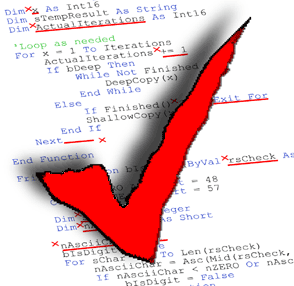

## What are Coding Standards

From having a certain amount of spaces to indent, to only using single quotes for a string, a representation of characters, coding standards are like the parents telling you to make your bed. Coding standards is a software engineering technique used to help with formatting code neatly.

## The Cheat Code to Learning a New Language?

Is coding standards the cheat code to learning a new coding language? I feel that, for certain languages, such as indentation based languages like Python, it can be helpful. But that’s not the case for most languages, as they incorporate indentation for readability and cleanliness purposes. I feel that coding standards aren't the most important thing in terms of software engineering. The way someone formats their code can be viewed as a type of dialect when speaking. For example, in Japanese, there are many dialects where pronunciation and word usage differ. There is no right nor wrong, as that is just how their language evolved and changed throughout time. 

## Fix Your Posture

I had worked with something similar in Intellij for jGRASP. I was 

