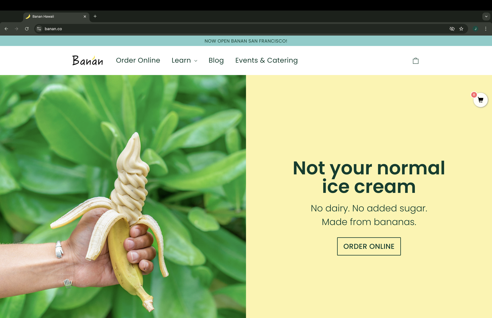

## What are UI Frameworks?

When you click on a website, there is more going on behind the scenes than you think. From being able to login into your account for Amazon to websites having a clean layout for users to browse clothing options. You can think of UI Frameworks or User Interface Frameworks as the backbone for what you may see on a website page. It can provide some formatting settings, dynamic effects, and even icons all to make a website more user friendly and appealing. Like the spacing between posters in a room, or the arrangement of a couch in a living room, UI Frameworks can easily help make a website look better. However, UI Frameworks like Bootstrap 5 can be a challenge to learn as it is like learning a whole new language. With that in mind, is it worth it to learn?

## The Outline for Success

It takes time to learn anything, but whether that topic is worth learning or not determines the importance of it. For Bootstrap 5, I feel that it is an important asset to keep under your belt. It may take some time to fully understand the fundamentals and how to apply them, but once you get it figured out, it makes building the front end of websites easier. One might think that you can use the baseline code of HTML and CSS to build a website page. While that is true, it will be more tedious to deal with margining and formatting the website to accommodate for different screen dimensions. 

## Can you spot the difference? 

For users just browsing the internet, it may be hard to notice any difference between a website that uses UI frameworks versus a website that doesn't. For example, Lanikai Juice has a website that does not use UI frameworks. Despite not using a framework, Lanikai Juices's website matches the visual and accessability of it's competitors website. On the contrary, Banan's website utilizes Bootstrap 5, a UI framework.

 

Comparing the two, there is not much difference when it comes to the functionality. Both have relatively similar layouts and both display their products well. The main difference between the websites, is what is going on behind the scenes. 