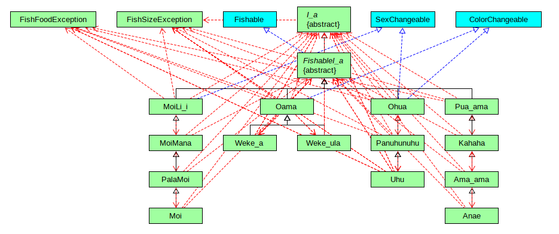

<p align="center">

</p>


## Playing the Game

Fishing frenzy bash is a text based fishing game that I helped create as a team project in ICS 211, Fall 2023. Essentially, it is a two player game, where the two players go head to head trying to catch the biggest fish to help them win. The game takes place over the course of a year, where the two players will take turns, each having three attempts to catch a fish every month. When hooking a fish, the player can choose to release the fish, or keeping the fish and adding it to their bag. However, there are rules in regards to each fish ranging from size regulations, fishing methods, and fishing seasons. Failure to follow these rules will result in the player empyting their bag, making it harder to win. In the end, the winner is decided by whoever has the largest three fish on average. 

## My Contributions

In this project, I was tasked with implementing the add and empty bag functions for each player to use.

## The Takeaways from This Project

Through this project, I was able to strengthen my skills in coding through implementing hierarchal relationships amongst 21 Java files, ultimately demonstrating proper usage of inheritance and polymorphism. Along with that, I was able to practice working within in a team, with emphasis on communication, as well as engage on the usage of Github.

Here is some code used to create the pond where the fishing takes place.

```java
public class FishingFrenzyBash {
   /** Max size capacity for pond. */
   static final int POND_SIZE = 56;
   /** Game duration in months. */
   static final int GAME_LENGTH = 12;
   /** Number of turns for player per month. */
   static final int PLAY = 3;
   /** 
   * Main method.
   * @param args not used
   */
   public static void main(String[] args) {
      // ArrayList for fish pond
      ArrayList<FishableI_a> lokoIa = new ArrayList<>();
      boolean fish = true;
      
      //Filliing up pond with baby fish
      lokoIa = FishingFrenzyBash.fillPond();
      
      // if(fish) {
   //          System.out.println(lokoIa);
   //       }
      
      //Simulating two years for fish growth
      FishingFrenzyBash.growFish(lokoIa);
      //Open pond for fishing
      FishingFrenzyBash.lawaIa(lokoIa);
      //
      
   } //close main
   
   /**
   * Fill pond method.
   * @return aList the fish pond
   */
   public static ArrayList<FishableI_a> fillPond() {
      ArrayList<FishableI_a> aList = new ArrayList<>();
      
      //make 50 baby fish in the pond
      
      for (int i = 0; i < 14; i++) {
         aList.add(new MoiLi_i());
         aList.add(new Oama());
         aList.add(new Pua_ama());
         aList.add(new Ohua());
      }
      return aList;
   
   } //close fillPond
```
 
Source: <a href="https://github.com/ICSatKCC/a6-lawa-i-fishing-game-f23-g4_f23_a6"><i class="large github icon "></i>ICSatKCC/a6-lawa-i-fishing-game-f23-g4_f23_a6</a>
