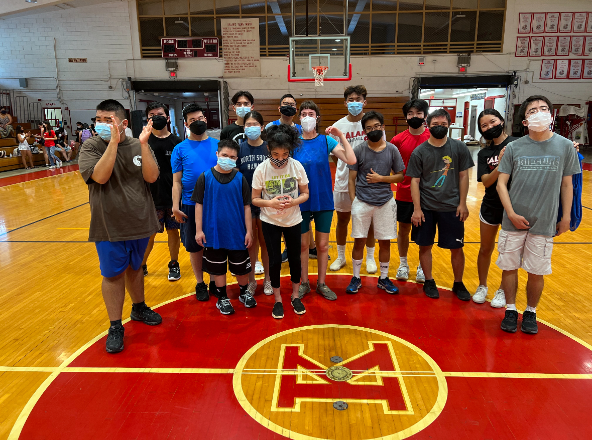

## Equal Oppurtunities
Friday Night Lights is a program that allows students with special needs or disabilities to participate in a basketball game. With the help of student mentors, these playes are able to experience the life of a student athlete. From practices right after school to games under the bright lights with sold out crowds, these students get to feel the inclusion. Through this program, students are also encouraged to engage in physical activity and work with others in a team setting.

## Coach Clifford 
I was fortunate enough to be apart of this program and help mentor my fellow classmates. It truly was a great experience being able to see the players having fun and smiling while playing the game of basketball. I helped the players learn the basic skills of basketball like dribbling, passing, and shooting a ball. My favorite memory from this was one day I was wearing a red shirt, and was appointed the nickname Coach Clifford by one of the players and soon everyone started calling me that. Through this experience, I was able to find my voice and learned the patience required to properly teach/coach a sport. I enjoyed mentoring/coaching the players to the point where I got interested in committing myself coaching a sport. Now I find myself coaching both middle school and high school volleyball.

For pictures and coverage of the game, please visit: <a href="https://scoringlive.com/story.php?storyid=18724">Friday Night Lights Basketball Games<a/>
