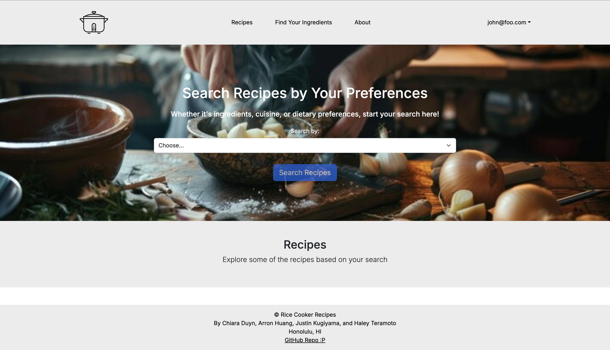

<p align="center">

</p>


## Don't Have Dinner Plans?

Rice Cooker Recipes is a website that my team and I worked on in ICS 314 at UH Manoa, which provides easy to follow recipes with minimal equipment and common ingredients. The idea is to change the approach that college students take towards meal planning and shy them away from unhealthy eating habits. Within the website, users are able to search for recipes based upon their dietary prefences, what type of cuisine, or what ingredients they want to include. Since we live in Hawaii, we decided to focus on the idea that rice cookers are a common household item that is capable of cooking a meal. There isn't a need for stoves or ovens when everything you need to cook a hearty meal can be found within a rice cooker!

## How I contributed

In this project, one of my major tasks was to display the recipes from the database. To start, we had to declare a recipe object which needed parameters for the recipe's title, ingredients, instructions, cuisine, dietary preferences, and image. Following that, we were able to start adding recipes to our database. For displaying the recipes, we needed to ensure that we not only connected to the database, but properly pulling each recipe and their parameters. A problem we ran into was that some of the images were not appearing because the database was not capable of holding onto PNGs or JPGs. In order to work around this, we used url links and now the images were properly showing.

Here is some code used to display the recipes from the database.

```javascript
const ListPage = async () => {
  // Protect the page, only logged in users can access it.
  const session = await getServerSession(authOptions);
  loggedInProtectedPage(
    session as {
      user: { email: string; id: string; randomKey: string };
      // eslint-disable-next-line @typescript-eslint/comma-dangle
    } | null,
  );
  const recipes: Recipe[] = await prisma.recipe.findMany({
  });
  return (
    <main>
      <Container id="list" fluid className="py-3">
        <Container>
          <Row>
            <Col>
              <h2 className="text-center">Recipes</h2>
              <Row className="mt-4">
                <Col className="text-center">
                  <Button href="/add" className="btn-dark" type="button">
                    Add Recipe
                  </Button>
                </Col>
              </Row>
              <Row xs={1} md={2} lg={3} className="g-4">
                {recipes.map((recipe) => (
                  <Col key={recipe.title}>
                    <RecipeCard recipe={recipe} />
                  </Col>
                ))}
              </Row>
            </Col>
          </Row>
        </Container>
      </Container>
    </main>
  );
};

export default ListPage;
```

## Biggest Takeaways

Asides from building upon teamwork skills and building a web application, this project helped to provide an insight of what it is like to work in a software engineering environment. An important topic that was demonstrated in this project was issue driven project management. It is the idea of breaking a large task into multiple smaller tasks in order to make them easier to manage as well as prevent conflicts within code. This allowed for our team to work efficiently, and made it easier to see where our code was successful or unsuccessful.

Source: <a href="https://github.com/ICSatKCC/a6-lawa-i-fishing-game-f23-g4_f23_a6"><i class="large github icon "></i>ICSatKCC/a6-lawa-i-fishing-game-f23-g4_f23_a6</a>
